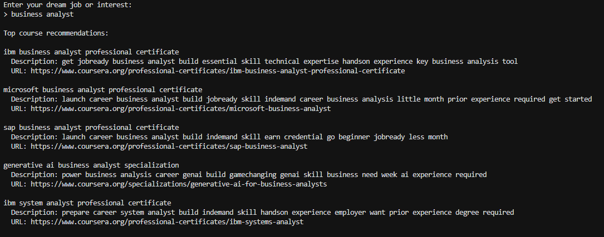
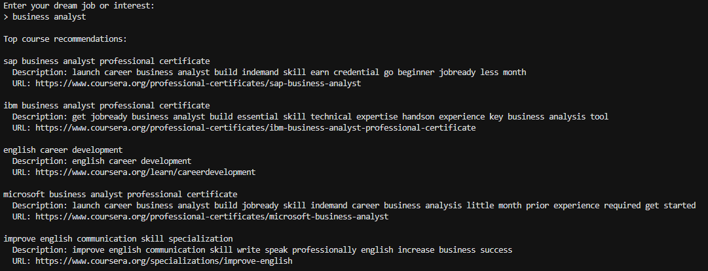

# 📚 Coursera Course Recommendation System

This project is the first hands-on task in MLOps portfolio program. I built a pipeline to scrape course information from coursera, collecting data from the first 30 pages. The result is a dataset of 360 courses, each containing details such as the course title, partner, subject, description, rating, level, duration, skills taught, and source URL

## 🎯 Objective and Approach
This system aims to recommend Coursera courses based on user input, such as career goals or desired skills

We use a Content-Based Filtering approach, which recommends courses whose content is most relevant to the user's query, based on course descriptions, title, and skills needed

I made two types of models:
### 1️⃣ TF-IDF Vectorizer
Converts course descriptions into word-based vectors based on term frequency and inverse document frequency.

TF-IDF captures the importance of a word in a document relative to the whole corpus. It's chosen for its simplicity, efficiency, and effectiveness for texts like course descriptions

### 2️⃣ Word2Vec
Converts descriptions into semantic vector representations using pretrained Word2Vec, by averaging word vectors.

Word2Vec captures the semantic meaning of words in dense vector form. By averaging the vectors of words in a course description, I obtain a semantic representation of the course. This method is useful for identifying meaningfully similar content, even if exact keywords differ.

Once all descriptions are vectorized, I use cosine similarity to compare the user's query vector with all course vectors. Cosine similarity measures the angle between two vectors, effectively capturing their similarity regardless of length

## 📄 Example Recommendation Output
After running the model, the user can view and compare results by either:
1. run `inference.py` file
2. check the saved ouput from the preprocessed data in `results/top_recommendations.csv`

✅ Let's take an example here I'm running the `inference.py` where the user can input their dream job or interest of "Business analyst"

> this is the result of the first model (using TF-IDF)

>this is the result of the second model (using word2vec)

While both models return relevant core courses for "business analyst", Model 2 also includes:

1. _“english career development”_, which targets a different career path
2. _“improve english communication skill specialization”_, which also not straigthly relevant to business analyst

This suggests that Model 2 is slightly noisier and may include semantically close but less relevant results. Such insights can guide further fine-tuning or filtering strategies

## 🍃 Reflection
During this hands-on, I encountered several challenges, especially due to the dynamic nature of Coursera's website
1. **Missing Description**
    * Some courses had misleading descriptions (instructor names instead of actual course summaries)
    * Solution: I replaced bad descriptions with the course title
3. **Additional Preprocessing**
    * Word2Vec required additional preprocessing steps like tokenization
    * Solution: I applied text tokenization after load the preprocessed data